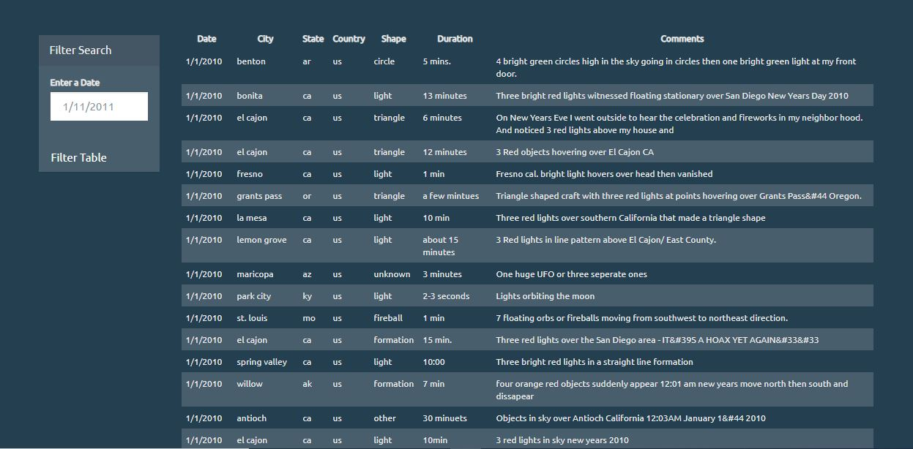

# javascript-challenge

I created a webpage that creates a table dynamically based upon a set of data around UFO sightings (data.js). Additional functionality included the ability for users to 
filter the table data for specific values. 

Languages used includes: JavaScript, HTML, CSS, and D3.js.

## How to Run Code

1. Clone the repository to a directory on your computer

2. Open the repository on a code source editor and navigate to UFO-level-1>index.html

3. Right click and click on "Open with live server"

4. Scroll down on the webpage in the browser to see the data

### Automatic Table and Date Search 

* Created a basic HTML web page (index.html)

* Using the UFO dataset provided in the form of an array of JavaScript objects, wrote code that appends a table to my web page and then adds new rows of data for each UFO sighting.

*  Columns included: `date/time`, `city`, `state`, `country`, `shape`, and `comment`.

* Used a date form in my HTML document and wrote JavaScript code that listens for events and searches through the `date/time` column to find rows that match user input.

## Screenshots

 Screenshot of home page display
 
 
 
Screenshot of UFO data table. I used a table to hold my data because I wanted the user to be able to see all of the detail pertaining to UFO sightings. In addition, the filter    box enables the user to limit data if they choose to. 

